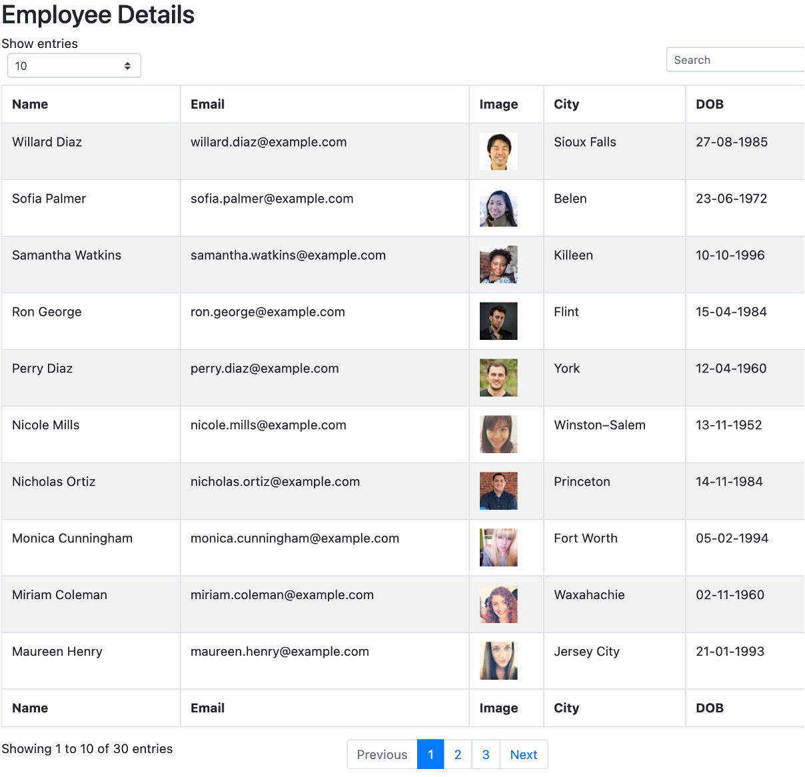

# EmployeeViewer

## Description
EmployeeViewer is a resource management solution, to enable managers within an organisation to keep track of their staff.

## Motivation
Everyone needs to keep track of their employees, but not everyone can afford SAP to do it.  EmployeeViwer provides a simple React app to manage all the key data about employees and their contact details.

## Functionality
EmployeeTracker runs in the command line, allowing users to access and interact with data on a SQL server.  The server holds a database with three tables of information (Employees, Roles and Departments). The user picks from a list of options, allowing them to either view, add or update information on this database.

## Screenshots



## Build status
Working prototype, requires testing and further development.

## Key technologies used
React
JavaScript
Node (esp. mdbreact, moment, axios)

## Code Example
```
import React from "react";
import EmployeeData from "./EmployeeDetail";
import API from "../utils/API";
import moment from "moment"

class OmdbContainer extends React.Component {
  state = {
    employeeRecords: [],
  };
  componentDidMount = () => {
    API.search()
      .then((response) => {
        let employeedata = response.data.results;
        let employeeRecordstemp = [];
        console.log(employeedata)
        for (let i = 0; i < employeedata.length; i++) {
          let efile = {
            name: employeedata[i].name.first + " " + employeedata[i].name.last,
            email: employeedata[i].email,
            image: ,
            city: employeedata[i].location.city,
            dob: moment(employeedata[i].dob.date).format("DD-MM-YYYY"),
          };
          employeeRecordstemp.push(efile);
        }
        console.log(employeeRecordstemp);
        this.setState({ employeeRecords: employeeRecordstemp });
      });
  };
```
## Installation
Published at https://coljcsmith.github.io/employeeviewer/

## Contribute
Git pull
